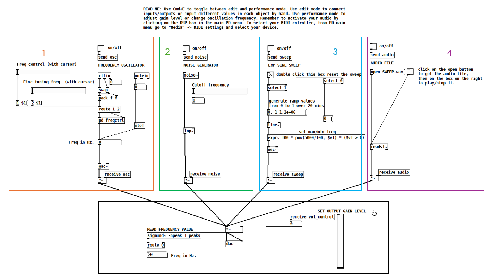
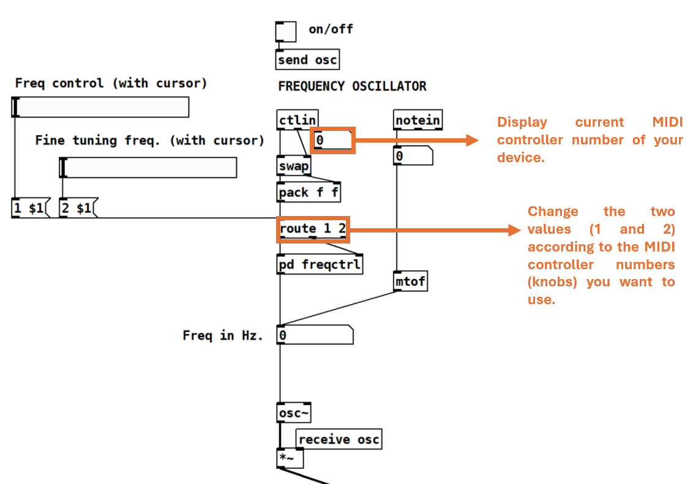
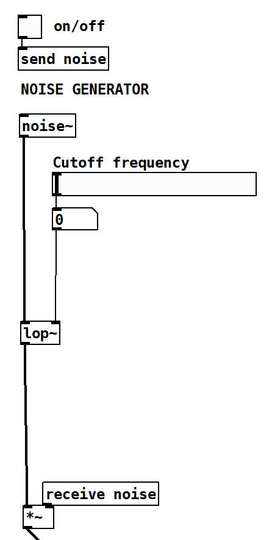
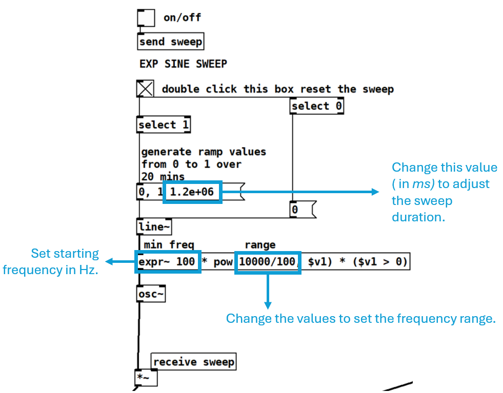
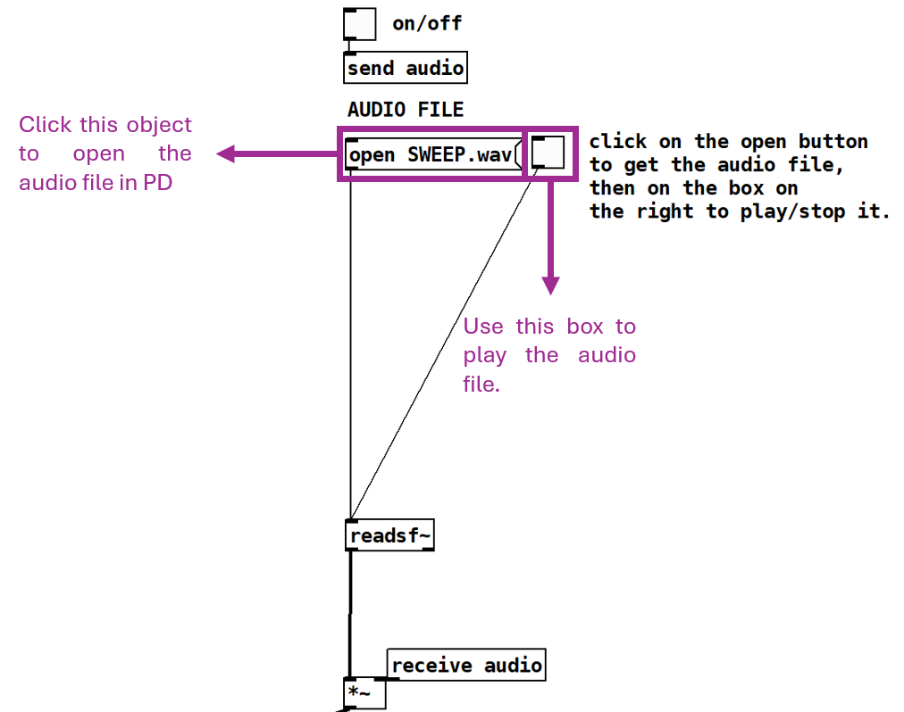
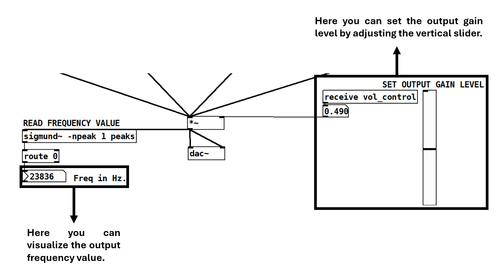

# Introduction

This patch is mainly intended to generate different test signals that can be useful when performing vibroacoustic tests on soundboards (e.g. Chladni patterns \cite{chladni2015treatise}). Nevertheless, its application could be extended to other measurements scenarios if needed (e.g. room acoustics purposes). This patch was built starting from previous work conducted within the [NEMUS ERC project](https://site.unibo.it/nemus-numerical-sound-restoration/en) available at: https://github.com/Nemus-Project/pd-utilities.

## Patch Sections and Guidelines

The test signals implemented in the patch include:
1. Frequency oscillator
2. Noise generator
3. Exponential sine sweep
4. External audio file

All the above mentioned sections are routed into a final output stage which allows you to monitor and control
the output gain level of your signal.


*Figure 1: Patch overview.*

In *Figure 1* you have an overview of the entire patch in which each sound source section is denoted by a different color. An “on/off” toggle to activate or deactivate a sound source is present above each section.

### Frequency oscillator

The frequency oscillator allows precise adjustment of your system’s excitation frequency. It can be controlled using two horizontal sliders: the upper slider provides raw frequency control, while the lower slider enables fine-tuning within a specific range. Additionally, the oscillator can be operated via an external MIDI controller. You can simply connect the controller to your pc and activate it through the main PD menu − > media
− > M IDIsettings. Then, if your controller has a keyboard you will be able to press a key and the frequency oscillator will output the corresponding frequency in Hz for that note. Otherwise, you can use two knobs on your controller to control the two sliders. To accomplish this, you should be able to use the first two knobs on your controller. However, depending on the layout of the midi controller numbers on your device you might have to make a small adjustment. Figure 2 reports a detailed view of the frequency oscillator section, By first checking the value corresponding to the knob used, you can consequently change the values in the route object to specify the preferred knobs (this operation must be performed in Edit mode by pressing Ctrl/Cmd + E).


*Figure 2: Frequency oscillator section detailed view*

### Noise Generator
The noise generator outputs a white noise signal which can be filtered by tweaking the cutoff frequency slider controlling a low-pass filter. Try to use this signal to stimulate the sound board of your instrument while monitoring the response by simply listening to the output or by looking at a spectrum analyzer connected to a recording device (e.g. accelerometer) attached to the board. Then add masses or play around with the braces position in real time on your soundboard, focus on the different acoustics response of the instrument or on the differences you observe from your spectrum analyzer. Further reference on this kind of analysis can be found in [2] .



### Exponential Sine Sweep
The exponential sine sweep section allows you to use a customized sweep as the excitation sound signal for your measurements. You can customize it by tweaking the values in the objects highlighted in *Figure 4*.



### Audio file 

This section allows you to upload your own audio file (.wav) and use it for your tests. Copy your.wav file into the same folder as the PD patch. Then, by clicking on the open object, pure data will get the audio file which
can then be played by toggling the box on its right. This is also illustrated in *Figure 5*.



### Output stage

This is the output section of the patch. You can both visualize the output frequency and adjust the output gain level of your generated test signal from the vertical slider.



## References

[1] Ernst Florens Friedrich Chladni. Treatise on Acoustics: The First Comprehensive English Translation of EFF Chladni’s Trait´e d’Acoustique. Springer, 2015.

[2] Ludovico Ausiello et al. “Affordable wide-band measurement ecosystem for musical acoustics based on electro-dynamic transducers”. In: Acta Acustica 8 (2024), p. 53.

## BibTex Citation

```bibtex
@misc{duran_pd_2025,
 author = {Sebastian Duran and Matthew Hamilton },
 date-modified = {2025-06-11 14:49:57 +0100},
 month = jun,
 publisher = {Zenodo},
 title = {Signals2Soundboards: Version 0.1.0},
 version = {0.1.0},
 year = 2025,
 url = {https://doi.org/10.5281/zenodo.15641239}}
```